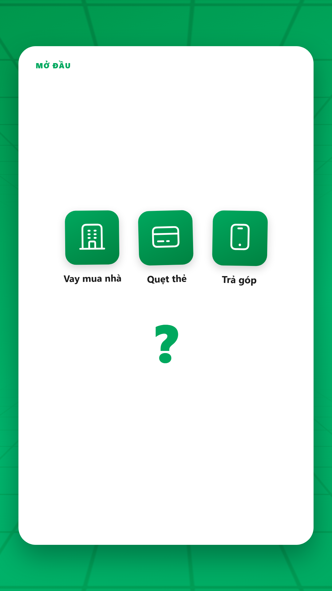
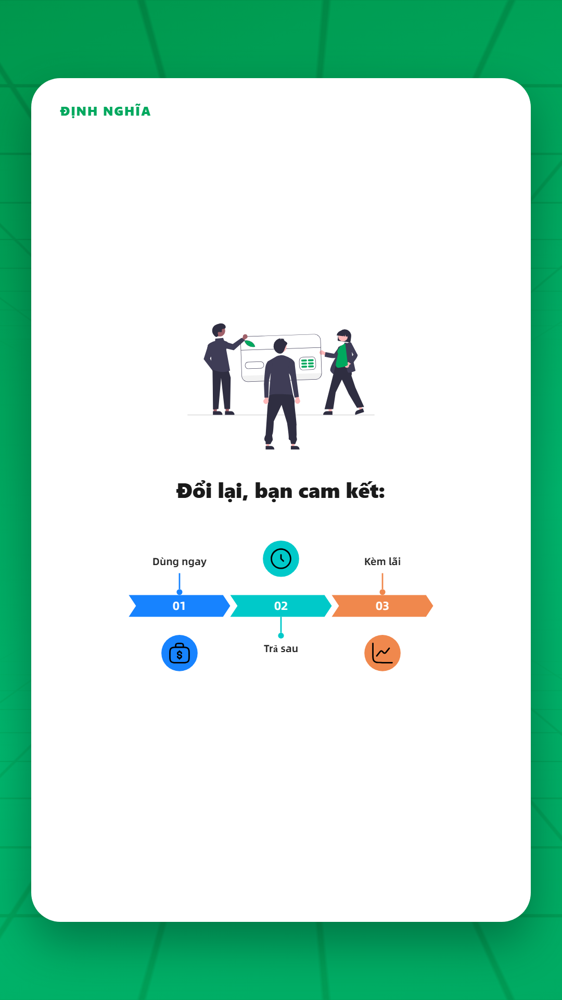
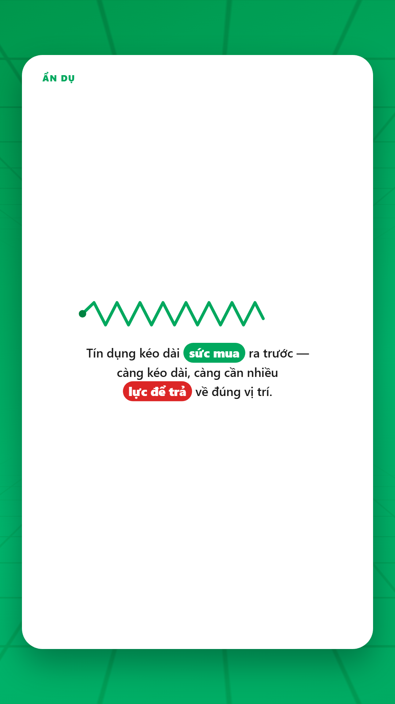
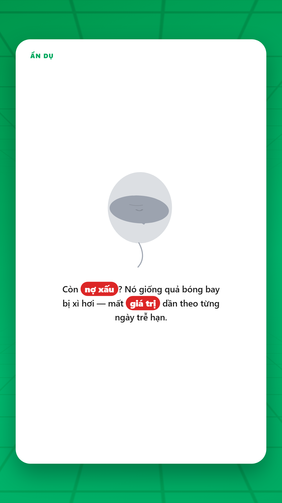
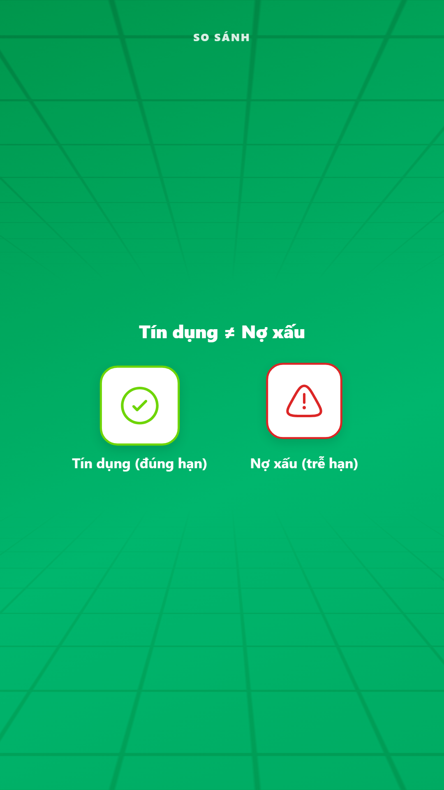
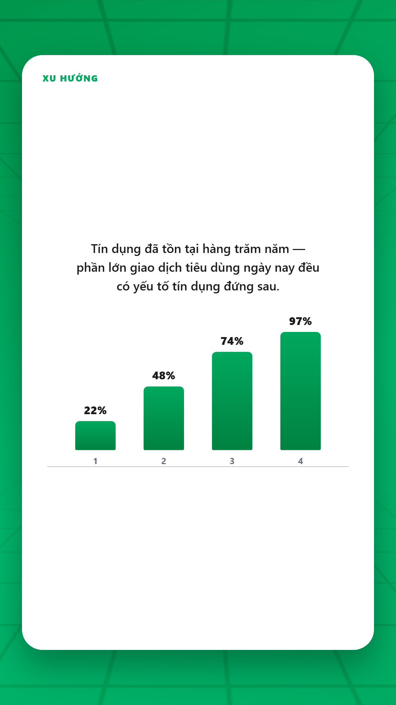
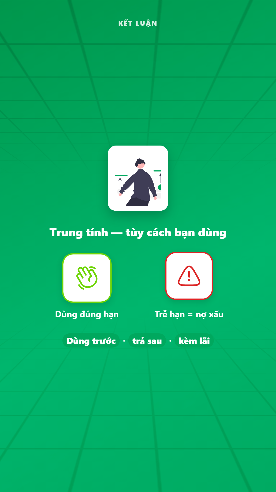

# Review package — "Tín dụng là gì?" (v5)

Chưa export MP4 — đây là gói xem trước để duyệt/góp ý: âm thanh nền, và mỗi cảnh gồm mốc thời gian / lời đọc / ảnh cuối cảnh (khung hình cuối, dễ hình dung nhất vì cảnh có animation) / SFX / mô tả hiệu ứng.

## Âm thanh nền toàn video
[ambient-pad.wav](sound/ambient-pad.wav) — loop, -18dB tương đối. Ambient drone/room-tone liên tục, giữ mix không bao giờ im lặng tuyệt đối.
> ⚠️ KHÔNG phải nhạc nền thật — chưa có nguồn nhạc royalty-free trong kho. Thay bằng mô tả mong muốn hoặc file nhạc thật để đổi.

## Danh sách cảnh

### card_0 — Tiêu đề (0.00s – 2.50s)

**Lời đọc:** Tín dụng là gì?

**Hình ảnh / bố cục:** Full-bleed gradient brand xanh + video nền chuyển động mờ. Chữ 'TÍN DỤNG LÀ GÌ?' trắng, to, giữa khung.

**Hiệu ứng:** GSAP scale+fade entrance (back.out); idle pulse sau khi ổn định

**SFX:**
  - **whoosh** — ngay khi chữ xuất hiện ([whoosh.wav](sound/whoosh.wav))

---

### card_1 — Mở đầu (Hook) (2.50s – 14.17s)

**Lời đọc:** Bạn vay tiền mua nhà, quẹt thẻ mua đồ, hay mua trả góp một chiếc điện thoại. Tất cả đều có một điểm chung: bạn đang dùng tiền của người khác, để trả sau. Nhưng chính xác thì, tín dụng là gì?

**Hình ảnh / bố cục:** Khung card trắng. 3 icon (nhà/thẻ/điện thoại) xuất hiện lần lượt đúng nhịp giọng đọc, mỗi icon 3 lớp GSAP (khung màu → glyph xoay vào → nhãn chữ), giữ nhịp bập bênh nhẹ. Kết bằng dấu '?' lớn phóng to.

**Hiệu ứng:** GSAP layered entrance per icon (box → glyph → label); idle bob+rotate sau khi ổn định; spring scale cho dấu '?'

**SFX:**
  - **whoosh** — đầu cảnh ([whoosh.wav](sound/whoosh.wav))
  - **pop** — mỗi icon xuất hiện (x3) ([pop.mp3](sound/pop.mp3))
  - **pop** — khi dấu '?' hiện ra (to hơn) ([pop.mp3](sound/pop.mp3))

---

### card_2 — Định nghĩa (14.17s – 29.83s)

**Lời đọc:** Tín dụng, nói đơn giản, là việc một bên, ngân hàng, tổ chức tài chính, hay người bán, cho bạn quyền sử dụng một khoản tiền hoặc giá trị hàng hóa ngay bây giờ, đổi lại bạn cam kết hoàn trả vào một thời điểm trong tương lai, thường kèm theo một khoản phí gọi là lãi suất.

**Hình ảnh / bố cục:** Khung card trắng. Đầu cảnh: illustration unDraw thật (người + thẻ tín dụng) hiện theo 3 lớp. Sau đó chữ 'Đổi lại, bạn cam kết:' rồi sơ đồ 3 bước (Dùng ngay → Trả sau → Kèm lãi) qua @antv/infographic.

**Illustration:** `svg/credit_card_payment.svg` → `CreditCardPaymentIllustration`

**Hiệu ứng:** UndrawReveal 3-layer GSAP (bg→body→accent); GSAP fade+y cho heading; idle pulse cho heading + sơ đồ sau khi ổn định

**SFX:**
  - **whoosh** — đầu cảnh ([whoosh.wav](sound/whoosh.wav))
  - **pop** — khi chữ 'cam kết' hiện ([pop.mp3](sound/pop.mp3))
  - **pop** — khi sơ đồ 3 bước hiện ([pop.mp3](sound/pop.mp3))

---

### card_3 — Ẩn dụ: Lò xo (29.83s – 41.17s)

**Lời đọc:** Hãy tưởng tượng tín dụng như một chiếc lò xo. Nó kéo dài sức mua của bạn ra trước thời gian thực tế bạn kiếm được tiền. Nhưng lò xo càng kéo dài, càng cần nhiều lực để kéo nó về đúng vị trí.

**Hình ảnh / bố cục:** Lò xo SVG vẽ tay (stroke-draw lúc vào), kéo dài dần đúng nhịp giọng đọc, đung đưa nhẹ khi đã kéo hết cỡ. Bên dưới câu chữ với 2 từ khóa dạng pill.

**Hiệu ứng:** stroke-dashoffset draw-in; interpolate độ dài lò xo theo frame; idle sway sau khi kéo xong

**SFX:**
  - **whoosh** — đầu cảnh ([whoosh.wav](sound/whoosh.wav))
  - **pop** — khi lò xo bắt đầu kéo giãn ([pop.mp3](sound/pop.mp3))

---

### card_3b — Ẩn dụ: Bóng bay xì hơi (nợ xấu) (41.17s – 50.17s)

**Lời đọc:** Còn nợ xấu? Nó giống như một quả bóng bay bị xì hơi. Giá trị mất dần theo từng ngày trễ hạn, và càng để lâu, càng khó bơm căng trở lại.

**Hình ảnh / bố cục:** Bóng bay đỏ nhiều lớp (quầng sáng mờ → dây vẽ nét → thân bóng → 2 nếp nhăn vẽ tay khi xì) xẹp dần đúng nhịp giọng đọc, đổi màu đỏ→xám khi xẹp quá nửa, đung đưa như con lắc sau khi xẹp xong.

**Hiệu ứng:** stroke-dashoffset draw cho dây + nếp nhăn; interpolate deflate theo frame; idle pendulum sway sau khi xẹp xong

**SFX:**
  - **whoosh** — đầu cảnh ([whoosh.wav](sound/whoosh.wav))
  - **pop** — khi bóng bắt đầu xì ([pop.mp3](sound/pop.mp3))

---

### card_4 — So sánh: Tín dụng ≠ Nợ xấu (50.17s – 62.33s)

**Lời đọc:** Nhiều người nghĩ tín dụng và nợ xấu là một. Không đúng. Tín dụng là công cụ trung tính, dùng đúng cách, nó giúp bạn xoay vòng vốn kịp lúc. Chỉ khi mất khả năng trả đúng hạn, tín dụng mới biến thành nợ xấu.

**Hình ảnh / bố cục:** Layout full-bleed (không khung card trắng) — nội dung nổi trên gradient+video nền. Tiêu đề trắng. 2 khối tròn trắng đối xứng hiện hard-cut: trái = tick xanh 'Tín dụng (đúng hạn)', phải = tam giác đỏ 'Nợ xấu (trễ hạn)'.

**Hiệu ứng:** hard-cut reveal (opacity 0/1, không easing); idle bob sau khi hiện

**SFX:**
  - **whoosh** — đầu cảnh ([whoosh.wav](sound/whoosh.wav))
  - **pop** — mỗi bên hiện ra (x2) ([pop.mp3](sound/pop.mp3))

---

### card_5 — Xu hướng / số liệu (62.33s – 72.83s)

**Lời đọc:** Tín dụng không phải khái niệm mới. Hệ thống ngân hàng hiện đại đã xây dựng trên nó hàng trăm năm, và ngày nay phần lớn giao dịch tiêu dùng trên thế giới đều có yếu tố tín dụng đứng sau.

**Hình ảnh / bố cục:** Khung card trắng. Câu dẫn hiện trước, sau đó biểu đồ 4 cột tự mọc dần từng cột (stagger), số % đếm lên đồng bộ theo từng cột.

**Hiệu ứng:** GSAP stagger scaleY cho từng cột (back.out); count-up số theo interpolate; idle pulse sau khi mọc xong

**SFX:**
  - **whoosh** — đầu cảnh ([whoosh.wav](sound/whoosh.wav))
  - **pop** — khi biểu đồ bắt đầu mọc ([pop.mp3](sound/pop.mp3))

> ⚠️ Số liệu 22/48/74/97% CHỈ LÀ MINH HỌA xu hướng tăng dần, KHÔNG có nguồn thật — cần thay nếu có số liệu thật.

---

### card_6 — Kết luận (72.83s – 82.83s)

**Lời đọc:** Tóm lại: tín dụng là quyền dùng trước, trả sau, kèm lãi suất, một công cụ tài chính trung tính, tốt hay xấu phụ thuộc vào cách bạn dùng nó.

**Hình ảnh / bố cục:** Layout full-bleed như Card 4. Illustration unDraw thật (người + biểu đồ tăng trưởng) trên nền trắng nhỏ đầu cảnh. Bên dưới 2 khối so sánh dùng đúng/trễ hạn. Cuối cảnh: 3 từ khóa dạng pill tóm tắt.

**Illustration:** `svg/personal_finance.svg` → `PersonalFinanceIllustration`

**Hiệu ứng:** UndrawReveal 3-layer GSAP; hard-cut reveal cho 2 khối so sánh; idle pulse cho dòng tóm tắt

**SFX:**
  - **whoosh** — đầu cảnh ([whoosh.wav](sound/whoosh.wav))
  - **whoosh** — trước dòng tóm tắt cuối ([whoosh.wav](sound/whoosh.wav))

---

## Cách góp ý (xem chi tiết ở SKILL video-review-workflow)
- **Sound**: thay file trực tiếp, hoặc mô tả không khí mong muốn để tự tìm trong kho.
- **Script**: sửa thẳng câu lời đọc, hoặc mô tả ý muốn đổi.
- **Image cuối cảnh**: upload ảnh mẫu + mô tả thay đổi — có thể đổi cả asset/illustration bên trong, không chỉ nền.
- **SFX**: đổi thẳng hoặc mô tả loại âm thanh muốn tìm.
Chỉ cần nói rõ "Cảnh <id>: đổi <mục> thành ..." — không cần gửi lại cả file.